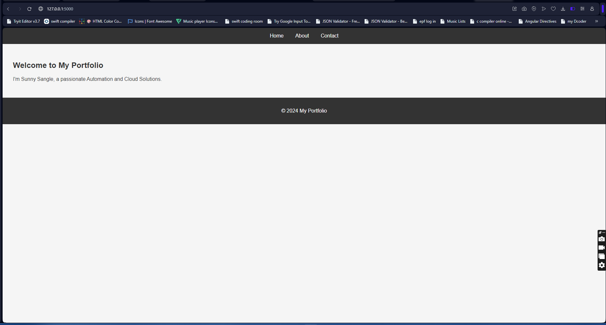
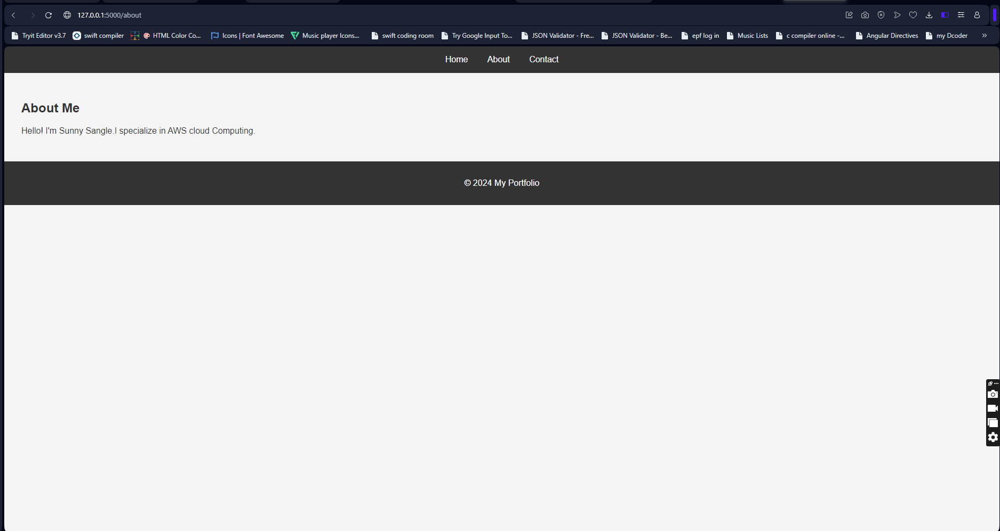
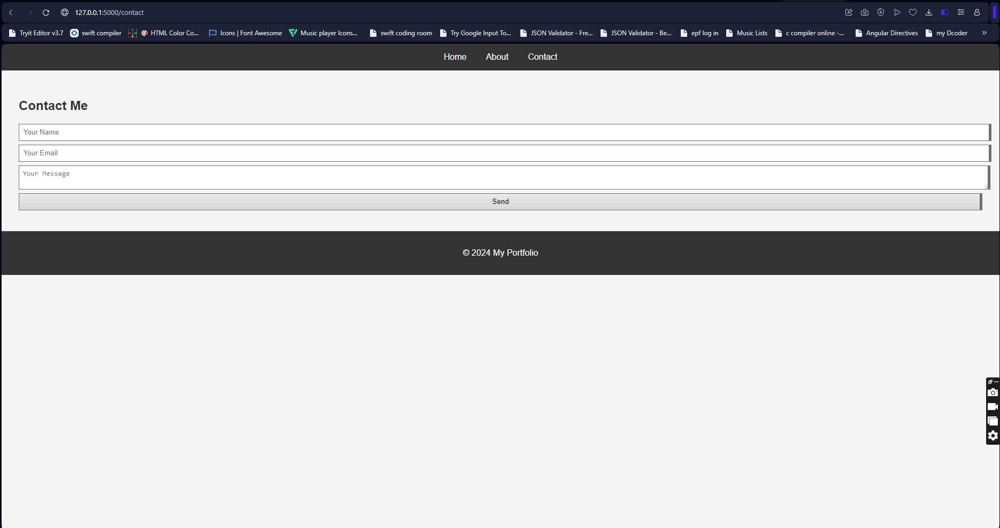

# Personal Portfolio Website

This is a personal portfolio website built using **HTML**, **CSS**, and **Python (Flask)**. The website showcases personal information, professional skills, and provides a way for visitors to contact me.

## Features
- **Home Page**: Brief introduction and welcome message.
- **About Page**: Details about skills, experience, and background.
- **Contact Page**: A functional contact form to collect messages.
- Responsive design for mobile and desktop users.

## Project Structure
```
portfolio/
├── static/
│   ├── css/
│   │   └── style.css
│   ├── js/
│   │   └── script.js
│   └── images/
├── templates/
│   ├── base.html
│   ├── index.html
│   ├── about.html
│   └── contact.html
├── app.py
└── README.md
```

## Technologies Used
- **Frontend**:
  - HTML5 for structuring content.
  - CSS3 for styling and layout.
- **Backend**:
  - Python 3 with Flask framework for server-side logic.
- **Deployment**:
  - Optionally deployable on platforms like Heroku, Render, or AWS.

## How to Run Locally
1. Clone the repository:
   ```bash
   git clone https://github.com/SunnySangle/portfolio.git
   cd portfolio
   ```

2. Install dependencies:
   Ensure Python is installed and run:
   ```bash
   pip install flask
   ```

3. Start the Flask server:
   ```bash
   python app.py
   ```

4. Open the application in your browser:
   ```
   http://127.0.0.1:5000/
   ```

## Screenshots




## Future Improvements
- Add a **Project Showcase** section with links to GitHub repositories.
- Integrate a database to store contact form submissions.
- Include a blog section to share articles and tutorials.
- Improve the design using frameworks like **Bootstrap** or **Tailwind CSS**.

## Contributing
Contributions are welcome! If you have any suggestions or improvements, feel free to submit a pull request.

## License
This project is licensed under the MIT License. See the `LICENSE` file for details.

---

**Contact**
- **Email**: your-email@example.com
- **LinkedIn**: [LinkedIn Profile] https://www.linkedin.com/in/sunny-sangle-a6172929a/
- **GitHub**: [GitHub Profile] https://github.com/SunnySangle
```

